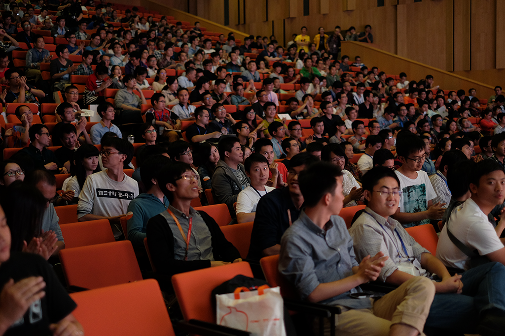
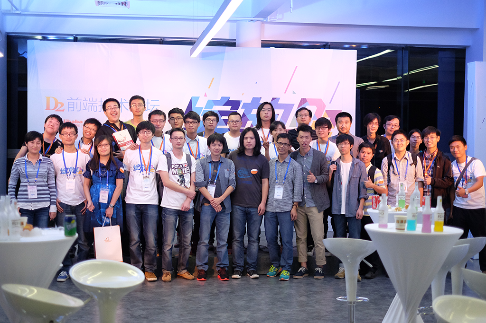

2015 年第十届 D2 前端技术论坛报名请前往 [d2forum.alibaba-inc.com](http://d2forum.alibaba-inc.com)

# D2 近期动态

- **[10月28日]** 更新嘉宾[分享主题资料](#%E6%97%A5%E7%A8%8B%E5%AE%89%E6%8E%92--%E4%BC%9A%E8%AE%AE%E8%B5%84%E6%96%99%E4%B8%8B%E8%BD%BD)。
- **[10月25日]** D2圆满结束，相关数据，会在整理后更新。
- **[10月20日]** 报名将在23:00整结束，23:00后的PR，将不再Merge。请已经通过的1000多名的厂内厂外童鞋合理安排时间，到时候一起嗨皮。
- **[10月16日]** 距离报名截至还有4天，已经有超过950名的厂内厂外童鞋拿到了邀请函，还在提交的童鞋请将资料尽量详尽，以免审核失败。
- **[10月13日]** 更新Bad Case一枚，**有关诚信**，前端圈子很小，良好氛围请大家一同爱护。
- **[10月11日]** 更新费用注释，以免产生不必要的误会。
- **[10月10日]** 报名截至时间: 10月20日 23:00 整。
- **[10月10日]** D2 分享日程更新，犹豫的童鞋请果断拿起手中的鼠标，戳一下发起PR的按钮，已经拿到票的童鞋不妨想想会后去哪儿玩，去哪吃顿好的犒劳奔波的自己。
- **[10月10日]** 酒会的票在**报名截至后**会使用邮箱的方式陆续发出提醒，请被选中的汉纸和妹纸稍安勿躁，:D
- **[10月10日]** 如果你的请求被merge但是没有收到邮件通知，可以联系我们，当然我们也会在**报名截至后**进行统一复查。

## 日程安排 && 会议资料下载

### 论坛邀请函可参加的分享内容

| 时间   | 报告厅                                  | 分会场                                           |
| ----- |-----------------------------------------| ------------------------------------------------|
| 10:00 | 主题发言                                 | -                                               |
| 10:30 | [《指尖上的数据》张可竞](./docs/D2-张可竞-指尖上的数据.pdf)                     | [《支付宝前后端分离的思考与实践》苏千（袁锋）](./docs/D2-苏千-支付宝前后端分离的思考与实践.pdf)         |
| 11:30 | 游园、自助午餐                            | 游园、自助午餐                                    |
| 13:30 | [《nodejs一小步 前端开发一大步》林楠](./docs/D2-林楠-nodejs一小步前端开发一大步.pptx)         | [《Listen to the buzz of Angular.JS》祝犁（田涛涛）](./docs/D2-祝犁-listern_to_the_buzz_of_AngularJS.pdf) |
| 14:30 | [《第三方开发前端实践》周杰](./docs/D2-周杰-第三方开发前端实践.pptx)                  | [《企业级 NPM 服务在阿里的实践》不四（何翊宇）](./docs/D2-不四-企业级 NPM 服务在阿里的实践.pdf)        |
| 15:30 | 观展、茶歇                                | 观展、茶歇                                        |
| 15:50 | [《面向多端的蘑菇街前端技术架构》贝勒（李振强）](./docs/D2-贝勒-面向多端的蘑菇街前端技术架构.zip) | [《航旅无线H5技术体系成长之路》弘树](./docs/D2-弘树-航旅无线H5技术体系成长之路.pdf)                  |
| 16:50 | [《京东前端工业化实践之路》刘威](./docs/D2-刘威-京东前端工业化实践之路.pdf)               | [《淘宝前端工程与自动化体系》一位（黄志龙）](./docs/D2-一位-淘宝前端工程与自动化体系.pdf)           |

注：论坛邀请函包含午餐。

### 酒会邀请函可参加的分享内容

| 时间   | 酒会地点                  |
| ----- |---------------------------|
| 18:30 | 酒会开始，自由交流          |
| 19:00 | @贺师俊 [透过ES6看JS未来](http://johnhax.net/2014/es6-js-future/)     |
| 19:20 | @邓钢 [架构与IBM前端](./docs/D2-邓钢-架构与IBM前端.zip)        |
| 19:40 | @张克军 [豆瓣的前端发展思路](./docs/D2-张克军-豆瓣的前端发展思路.pdf)   |
| 20:00 | 自由交流                   |
| 21:00 | 酒会结束                   |

- 注^[1]: 如果得到的邀请函是酒会邀请函，建议返程为第二天，以免时间仓促。
- 注^[2]: 特别欢迎酒量好的童鞋前来应战，请在`pull request`中低调注明。
- 注^[3]: 酒会的票在**报名截至后**会使用邮箱的方式陆续发出提醒，请被选中的汉纸和妹纸稍安勿躁，:D

# D2 2014 Ticket 是什么

本仓库为`2014年D2 前端技术论坛`邀请函自助申请通道，和其他的通道一起为本次参会厂外童鞋服务。（厂内童鞋请内网联系@懒懒交流会主席-紫英）

# 如何自助申请D2邀请函

如果你对`D2 2014`感兴趣，那么不妨：

- 先`fork`本项目，
- 然后先[登记入场信息](http://ued.taobao.org/blog/D2.ticket)，
- 接着参考`tickets`目录中的[示例文件](demo/ticket-demo.md)的格式，在`tickets`新建一个`“你的”-D2邀请函申请.md`(例如:"晓白-D2邀请函申请.md")为名称的文件，
- 再仿照例子填写相关资料，
- 最后发一条`pull request`(pull request标题内容为之前**登记入场信息后获得的标题内容**)。

D2 2014`票务小组的童鞋们`将会对你提交的申请资料进行审核，如果审核通过，将会使用邮箱联系的方式通知你哟。

建议认真阅读下一节内容，`如何提高获得邀请函的概率`，Good Luck，我们在西溪园区等着你。

- 注^[1]: 登记入场信息的[示例说明](demo/info-submit-demo.md)。
- 注^[2]: 票的类型分为白天的`论坛邀请函`和晚上的`酒会邀请函`，后者数量仅有100张，票务小组将会在各个通道进行更为严格的筛选~
- 注^[3]: 请务必保持收到确认邮件后回复的手机号码可用，号码将作为来园区的凭证和抽奖环节的依据，祝各位好运~
- 注^[4]: 会议主要受众为前端方向的技术人员，但是一样欢迎其他技术领域的童鞋也来一起玩耍。
- 注^[5]: 根据`D2票务小组`的激烈讨论，妹纸默认送出`酒会邀请函`，如果您有别的安排或其他原因不能参加，申请时请说明只需求`论坛邀请函`。

# 如何提高获得邀请函的概率

本届D2的分享质量将一如既往，在保持分享者水平的同时，我们也会努力保证与会听众的水准，所以会由`票务小组的童鞋们`来进行与会人员的水平监督。
票务小组的童鞋一致讨论后，得出了以下几条提高概率的方法：

* 真实详细的资料，审核通过后，票务小组可以第一时间联系到你。
* 质量较高的Github帐号或者博客，对前端有强烈的兴趣和热爱。
* 各个渠道较早投递来的童鞋，票数有限，先到先得。
* 你是妹纸...
* 你是妹纸，并且长的很好看...
* 你是妹纸，并且长的很好看，而且没有男朋友...
* 有图有真相，你懂的。

    - 小白：“为毛我没有得到邀请函？难道是我Github不活跃以及博客老写无病呻吟的博文导致我被票务小组干掉了嘛？！”
    - 小紫：“不，你挺好的，唯一的遗憾是，因为你不是妹纸...”
    （以上情节纯属虚构，如有雷同纯属故意，:D）

# 申请没有通过的原因

- 可能票务小组的童鞋们还没有审核到你的申请。
- 或许你可以在`tickets`目录中的[ticket-bad-case.md](demo/ticket-bad-case.md)文件中找到原因。

# 如何重新进行申请

    如果某个信息填写错误，可能会影响到以下内容：

- 真实姓名 && 手机号码填写错误，无法进入园区参加会议以及无法参与抽奖活动。
- 邮箱填写错误，无法接受电子票，无法签到以及无法参与抽奖活动。

    很庆幸的是，如果我们的申请还在等候审核的时候，我们可以自己来取消之前的申请，并重新发布一个新的邀请函申请：

- [新建一个issue](https://github.com/soulteary/Get-D2-2014-Ticket/issues/new)
- issue标题填写为：`重置申请[你在登记入场信息页面获得的标题]`(如: `重置申请[d09f3d9e643069e61c66e0f77020e446]`)
- 将issue的标签(label)设置为`重置请求`
- 然后就可以重新在[淘宝UED官方博客](http://ued.taobao.org/blog/D2.ticket)登记正确的入场信息啦。

    如果你已经在邮箱里收到了电子票...

- 请通过页面底部的微博或者微信联系方式，给我们留言，或者新建一个标签不为`重置请求`的issue，我们将稍后人工解决这个问题，:D

# 关于 D2 2014

## D2 前端技术论坛简介

D2 前端技术论坛(Designer & Developer Frontend Technology Forum)，简称 D2。
为国内前端开发者和网站设计师提供一个交流的机会，一起分享技术的乐趣，探讨行业的发展，以技术会友。
它是中国所有前端开发者的节日，包括前端设计师，前端开发工程师，和所有对前端技术感兴趣的人。
D2将努力营造一种轻松自由的交流氛围，没有任何商业色彩，以纯粹的技术交流为根本，共同推动国内前端技术的发展，
促进国内行业标准跟国际的融合，发掘前端技术可以创造的更大价值。 

## 今年的主题

经历了近10年的发展，前端岗位从刀耕火种走到了今天的百花齐放，各领域全面发展，进入盛况时期。2014 D2的主题即为“绽放”！

## 今年的举办地点和具体时间

杭州 - 阿里巴巴西溪园区，10月25日。

## 交通方式提示

如果你是第一次来杭州，可以参考[图片版-交通方案](docs/traffic.md)。

## 论坛费用

免费，由阿里巴巴集团负责本次论坛的所有费用。
- 注^[1]: 为了避免误解，我们提供的费用为论坛会议的相关场地、午餐费用，差旅请自行处理，见issue:[#28 费用免费包括报销路费吗……](https://github.com/soulteary/Get-D2-2014-Ticket/issues/28)。

## 历年D2纪事

- 2014 第九届 D2 论坛主题 《绽放》
- 2013 第八届 D2 论坛主题 《跨越》
- 2012 第七届 D2 论坛主题 《奔跑Run！——在大前端路上》
- 2011 第六届 D2 论坛主题 《Boom! Let’s Get D2 Crazy!》
- 2010 第五届 D2 论坛主题 《D平方（D2 = D²），潜能无限》
- 2009 第四届 D2 论坛主题 《蜕变·成长》
- 2008 第三届 D2 论坛主题 《前沿技术和前端协作》
- 2008 第二届 D2 论坛主题 《现代前端技术在网站中的应用》
- 2007 第一届 D2 论坛主题 《前端技术：未来一两年的发展与实践》
- D2 地区沙龙、D2 走进校园...等

## 会议掠影

## 其它联系方式

- [微博: http://weibo.com/d2forum](http://weibo.com/d2forum)
- [微信: d2forum.org@gmail.com](assets/img/weixin-qrcode.jpeg)

## 通知信件发送邮件(机器发送/无需回复)，如有必要，请添加联系人

- 非Gmail用户使用懒懒交流会邮箱:(lanlan@alibaba-inc.com)
- Gmail用户则使用Gmail发信邮箱:(d2.notice.robot@gmail.com)
