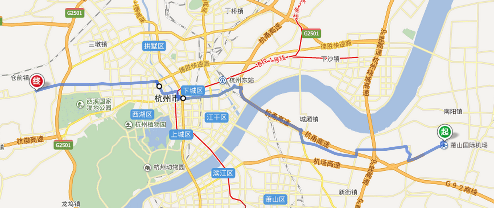
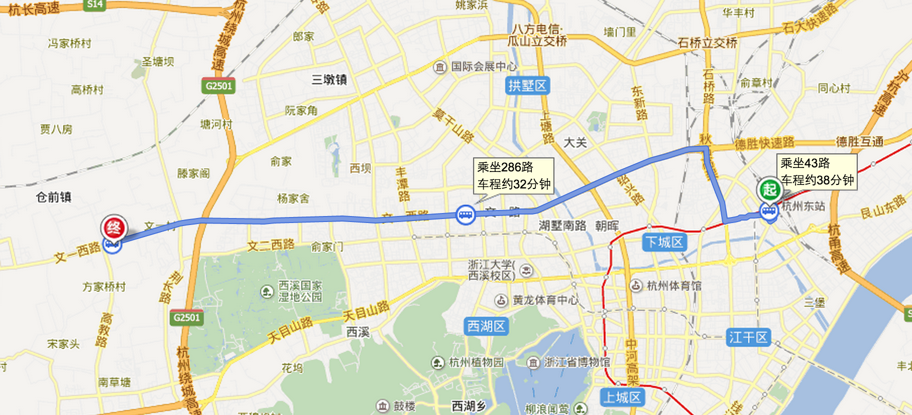
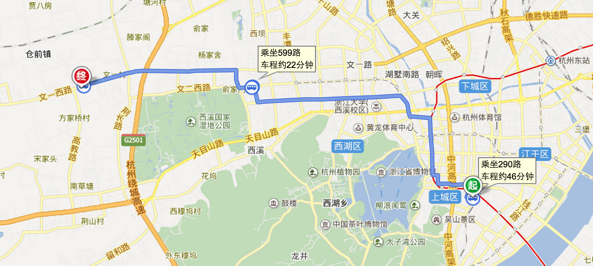

# 交通方案参考

## 如果你出现在“萧山国际机场”

### 贴士

如果乘坐`灰机`，降落机场是`杭州萧山国际机场`，网上推荐线路是乘坐武林门大巴，实则可以用下面的更好的方案来代替：

1.先乘坐`蒋村公交中心大巴`，再换乘`286路`(或 599路, 311路)，途径3站在`浙江理工大学科艺学院站`下车，或打车，约40左右。
2.机场出租车长队排队，然后打车直接至`阿里巴巴西溪园区`，和师傅说`文一西路 淘宝城`也行。

如果是其他方式，可以直接参考电子地图推荐路线。

机场巴士，[蒋村线参考](http://bus.hangzhou.com.cn/line.php?line_id=838)。

### 地图

注: 蒋村之前是大概路线，没有找到靠谱的地图导航，不需要关注细节。

## 如果你出现在“火车东站”

### 路线参考

1.步行至`火车东站西站`，乘坐`43路`公交车经过14站在`宋江村站`下车，再换乘`286路`经过9站，在`浙江理工大学科艺学院站`下车。

### 地图

## 如果你出现在“城站火车站”

### 路线参考

1.乘坐`290路`公交车经过21站在`府新花园北站`下车，再换乘`599路`经过3站，在`浙江理工大学科艺学院站`下车。

### 地图

## 特别注意

以上路线都仅为参考，具体方案，请参考自己的具体情况决定，注意安全，D2等着你的到来。
